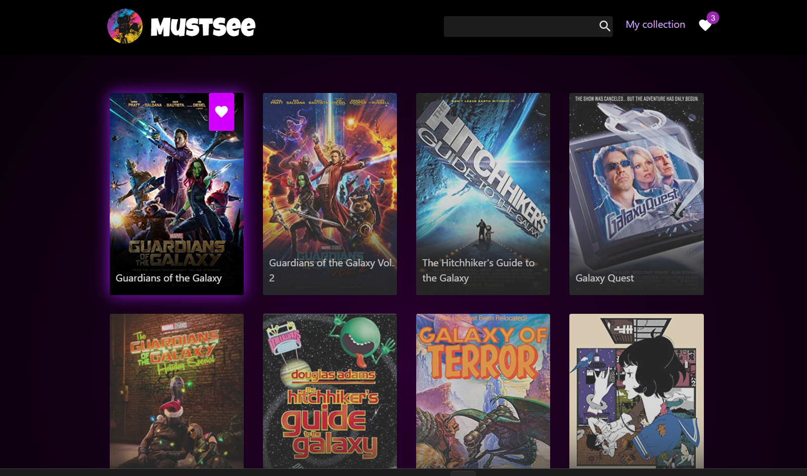

Movie App
> mustsee-movie-organizer-react


 ## [Demo](https://mustsee-movie-organizer-react.vercel.app/)
 
 


## Tools


- npm
- node js
- react js, react-router-dom, zustand, MUI

A mini movie app that uses the OMDB API to display movie information and allows users to create a list of their favorite movies. The app is built using React JS, Zustand for state management, MUI for styling.

Used API's: search movies [API](https://www.omdbapi.com/), create an favorite [movie organizer API](https://github.com/NikoFX/express-movie-organizer-API)


## Development setup

```sh
npm install
npm run dev
```
Local:   http://localhost:5173/

➜  press h to show help

  Shortcuts
 - press r to restart the server
 - press u to show server url
 - press o to open in browser
 - press c to clear console
 - press q to quit

## Meta

 Nijat Gurbanov

- Github: [github.com/NikoFX](https://github.com/NikoFX)
- Twitter: [Nijat Gurbanov](https://twitter.com/)
- Linkedin: [linkedin.com/in/nijat-gurbanov-dev](https://www.linkedin.com/in/nijat-gurbanov-dev/)

## Contributing

1. Fork it
2. Create your feature branch (`git checkout -b feature/fooBar`)
3. Commit your changes (`git commit -am 'Add some fooBar'`)
4. Push to the branch (`git push origin feature/fooBar`)
5. Create a new Pull Request
